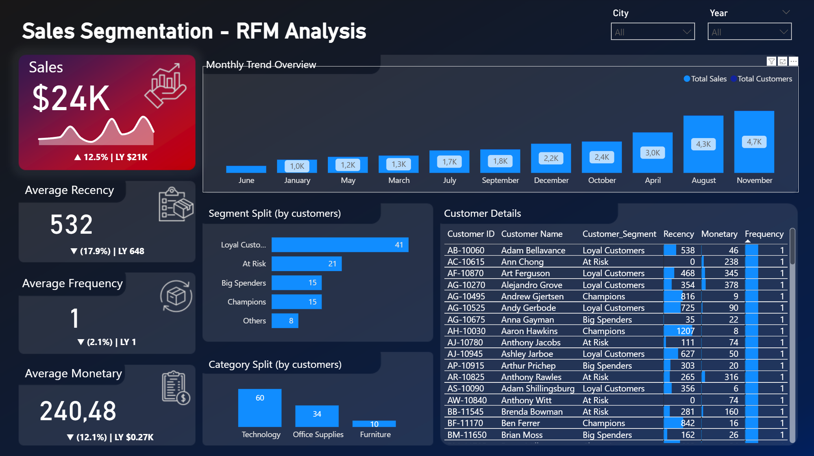

# 📊 RFM Customer Segmentation Dashboard (Power BI)

## 🔍 Project Overview
This project applies **RFM analysis (Recency, Frequency, Monetary)** to identify customer behavior patterns and segment them into groups such as champions, loyal, big spenders, and at-risk customers, others.  
The goal is to help businesses target customers more effectively and increase retention through data-driven insights.

---

## 🧰 Tools & Technologies
- **Power BI** – Data modeling, DAX calculations, and visualization  
- **Excel / CSV** – Data preparation and cleaning  
- **RFM Model** – Customer segmentation framework  

---

## 📈 Key Insights
- Segmented customers into 5 RFM levels for Recency, Frequency, and Monetary value  
- Identified high-value and at-risk customer groups  
- Built KPI cards for quick business decision-making  
- Designed a clean, modern Power BI dashboard  

---

## 🖼️ Dashboard Preview

---

## 📂 Files in This Repository
| File | Description |
|------|--------------|
| **Superstore 2025.csv** | Dataset used for RFM analysis |
| **RFM-analysis.pbix** | Power BI file with the complete interactive dashboard |
| **dashboard_main.png** | Preview image of the Power BI dashboard |

---

## 🧭 How to Use
1. Download `Superstore 2025.csv` and `RFM-analysis.pbix`
2. Open the `.pbix` file in Power BI Desktop
3. Explore the visuals and segment logic inside the report

---

## 👩‍💼 Author
**Olha Jarland**  
📍 Bergen, Norway  
💼 Data & Financial Analyst  
🔗 [LinkedIn](https://www.linkedin.com/in/olha-jarland-503931388)

---

## ⭐ About the Project
This Power BI dashboard demonstrates practical use of **data analytics in marketing and business intelligence**.  
It showcases how data visualization can help companies make strategic decisions based on customer behavior and sales performance.
